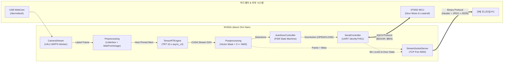

# Smart Recycling Edge AI Vision Pipeline

[](https://www.nvidia.com/en-us/autonomous-machines/embedded-systems/jetson-orin/)
[]()
[]()
[]()
[]()

> **NVIDIA Jetson Orin Nano 기반 스마트 재활용 키오스크 온디바이스 엣지 AI 비전 시스템**  
> 고성능 YOLOv11 TensorRT 10.x 추론 파이프라인, 안전 보장형 FSM 도어 자동 제어, 초저지연 TCP 관제 스트리밍 서버를 단일 통합 엣지 파이프라인으로 구현한 프로젝트입니다.

---

## 📌 목차 (Table of Contents)

1. [프로젝트 개요](#-프로젝트-개요)
2. [시스템 아키텍처 및 데이터 흐름](#-시스템-아키텍처-및-데이터-흐름)
3. [핵심 엔지니어링 특징 및 성능 최적화](#-핵심-엔지니어링-특징-및-성능-최적화)
4. [하드웨어 및 개발 환경 사양](#-하드웨어-및-개발-환경-사양)
5. [디렉토리 구조](#-디렉토리-구조)
6. [통신 프로토콜 규격](#-통신-프로토콜-규격)
7. [설치 및 빠른 실행 가이드](#-설치-및-빠른-실행-가이드)
8. [설정 가이드 (Configuration)](#-설정-가이드-configuration)
9. [트러블슈팅 (FAQ)](#-트러블슈팅-faq)

---

## 💡 프로젝트 개요

본 프로젝트는 스마트 분리수거 키오스크의 메인 엣지 컴퓨팅 두뇌 역할을 담당합니다.
투입구에 제시된 재활용 객체(페트병, 캔, 종이 등)를 실시간 카메라 영상에서 고속 검출하고, 검출 신뢰도 및 시간적 안정성이 검증되면 액추에이터 제어 보드(STM32 MCU)로 도어 개방 명령을 하달하며, 중앙 관제 센터(PC)에 실시간 영상 및 적재 현황 텔레메트리를 초저지연으로 브로드캐스팅합니다.

### 주요 기능

- **온디바이스 실시간 AI 추론**: YOLOv11 모델을 TensorRT 10.x로 최적화하여 Jetson Orin Nano에서 60 FPS급 초저지연 추론 수행
- **안전 보장형 FSM 도어 제어**: 검출 디바운싱(연속 15프레임), 최소 안전 개방 유지(2.0초), 최대 타임아웃(10초)으로 투입 안전 및 오동작 원천 방지
- **UART 하드웨어 통신 & 시뮬레이션**: STM32 MCU와의 양방향 ASCII 프로토콜 연동 및 장치 미연결 시 자동 Mock 시뮬레이터 지원
- **초저지연 TCP 관제 스트리밍**: 8바이트 고정 헤더 바이너리 패킷 기반 실시간 JPEG 영상 및 메타데이터 동시 송신

---

## 🏗 시스템 아키텍처 및 데이터 흐름

엣지 비전 파이프라인은 카메라 캡처, AI 모델 추론, 도어 제어 상태 머신, 외부 통신 I/O가 상호 간섭 없이 유기적으로 동작하도록 설계되었습니다.



---

## ⚡ 핵심 엔지니어링 특징 및 성능 최적화

### 1. Zero-Allocation GPU 추론 파이프라인 ([core/trt_engine.py](core/trt_engine.py))

- **Host Pinned Memory**: `cuda.pagelocked_empty`를 사용하여 가상 메모리 페이징을 방지하고 GPU DMA 전송 대역폭을 극대화
- **TensorRT 10.x V3 API 바인딩**: 엔진 로드 시 입출력 버퍼 물리 주소를 사전 등록(`set_tensor_address`)하여 매 추론 시 메모리 할당 오버헤드 완전 제거 (0-overhead)
- **비동기 CUDA Stream**: `memcpy_htod_async` $\rightarrow$ `execute_async_v3` $\rightarrow$ `memcpy_dtoh_async` 파이프라인을 단일 CUDA Stream에서 비동기 처리 후 동기화

### 2. 지연 없는(Zero-Lag) 카메라 캡처 ([core/camera.py](core/camera.py))

- **드라이버 버퍼 최소화**: `CAP_PROP_BUFFERSIZE = 1` 및 MJPG 하드웨어 포맷을 강제하여 Linux 커널 링 버퍼에 오래된 프레임이 누적되는 지연(Lag) 현상 차단
- **백그라운드 스레드 폴링**: 데몬 스레드가 최신 프레임을 지속적으로 갱신하고 메인 루프는 스레드 락 기반으로 대기 없이 즉시 최신 프레임 획득

### 3. C++ 네이티브 가속 전/후처리 ([core/detector.py](core/detector.py))

- **Letterbox 캔버스 사전 캐싱**: 프레임마다 발생하는 114 Gray 패딩 캔버스 동적 할당을 방지하기 위해 템플릿 메모리 사전 할당
- **단일 C++ 루틴 전처리**: `cv2.dnn.blobFromImage`를 활용하여 BGR $\rightarrow$ RGB 색상 변환, $1/255$ 스케일링, HWC $\rightarrow$ NCHW 축 전치를 C++ 레벨에서 일괄 처리
- **NumPy 벡터화 마스킹 + C++ NMS**: 8,400개 앵커 박스를 NumPy 벡터 마스킹으로 1차 고속 필터링한 후 `cv2.dnn.NMSBoxes`를 통해 파이썬 루프 대비 수십 배 빠른 NMS 수행

### 4. 안전 보장형 FSM 도어 컨트롤러 ([core/door_controller.py](core/door_controller.py))

- **시간적 디바운싱(Debouncing)**: 단일 프레임 오인식에 따른 도어 오작동을 막기 위해 연속 `stable_frames`(15프레임, 약 0.5초) 이상 유지 시에만 개방
- **신체 끼임 방지 최소 홀드 시간**: 도어 개방 후 사용자가 손을 투입하는 안전 시간을 확보하기 위해 최소 `min_hold_sec`(2.0초) 동안 닫힘 명령 유보
- **스마트 부재 감지 & 하드 타임아웃**: 물체 미인식 `lost_tolerance`(15프레임) 도달 시 자동 폐쇄하며, 물체가 계속 감지되더라도 모터 과열 및 방치를 방지하는 최대 개방 시간(`max_open_sec=10.0s`) 강제 적용

### 5. 신뢰성 높은 UART I/O & 시뮬레이터 지원 ([stream/serial_controller.py](stream/serial_controller.py))

- **스레드 세이프 송수신**: 백그라운드 수신 스레드와 명령 송신 간 락(Lock) 동기화
- **자동 Mock 시뮬레이터**: 시리얼 포트 미연결이나 로컬 개발 PC 환경에서는 에러로 중단되지 않고 가상 응답 모드로 자동 전환되어 무중단 개발/테스트 지원

### 6. 초저지연 커스텀 TCP 스트리밍 ([stream/socket_server.py](stream/socket_server.py))

- **경량 바이너리 헤더 프로토콜**: 8바이트 Big-Endian 헤더(`[Image Size 4B][JSON Size 4B]`)를 사용하여 역직렬화 지연 최소화
- **소켓 레벨 최적화**: `TCP_NODELAY` 활성화로 Nagle 지연 제거, `SO_SNDBUF` 256KB 확장 및 `SO_REUSEADDR` 적용

---

## 💻 하드웨어 및 개발 환경 사양

| 구분                  | 사양 및 환경                                                |
| :-------------------- | :---------------------------------------------------------- |
| **Edge Target**       | NVIDIA Jetson Orin Nano Developer Kit (8GB / 4GB)           |
| **OS / L4T**          | Ubuntu 22.04 LTS / JetPack 6.1 (L4T 36.x)                   |
| **CUDA Toolkit**      | CUDA 12.x / cuDNN 9.x                                       |
| **Inference Engine**  | NVIDIA TensorRT 10.3.0 (`python3-libnvinfer`)               |
| **Computer Vision**   | OpenCV 4.8.0 (V4L2, GStreamer, C++ DNN)                     |
| **Python Runtime**    | Python 3.10.12 (NumPy >= 1.23.0, < 2.0.0)                   |
| **카메라 인터페이스** | USB V4L2 WebCam (`/dev/video0`), 640x480 @ 60 FPS (MJPG)    |
| **MCU 인터페이스**    | STM32 MCU UART (`/dev/ttyTHS1` 또는 가상 포트), 115200 Baud |
| **관제 네트워크**     | TCP Socket Server (Port 9000, 0.0.0.0)                      |

---

## 📁 디렉토리 구조

```plaintext
edge_jetson/
├── configs/
│   ├── __init__.py
│   └── config.py              # 전역 불변(Frozen) 설정 (카메라, 모델, FSM, 통신)
├── core/
│   ├── __init__.py
│   ├── camera.py              # V4L2 백그라운드 스레드 초저지연 프레임 캡처
│   ├── detector.py            # Letterbox 전처리 + TensorRT 추론 + C++ NMS
│   ├── door_controller.py     # 디바운스 & 안전 타이머 기반 도어 제어 FSM
│   └── trt_engine.py          # TensorRT 10 V3 비동기 Host Pinned Zero-Alloc 엔진
├── models/
│   ├── rps_yolo11n_custom_640.engine  # Jetson Orin 최적화 TensorRT 엔진 파일
│   └── rps_yolo11n_custom_640.onnx    # 원본 ONNX 모델 (FP16/INT8 변환용)
├── stream/
│   ├── __init__.py
│   ├── protocol.py            # Jetson-STM32 UART ASCII 프로토콜 파서
│   ├── serial_controller.py   # 스레드 동기화 UART I/O 및 Mock 시뮬레이터
│   └── socket_server.py       # 관제 PC 연동 TCP 영상/텔레메트리 서버
├── utils/
│   ├── __init__.py
│   └── keyboard.py            # 터미널 cbreak 모드 논블로킹 키 입력 리더
├── main.py                    # 엣지 비전 파이프라인 메인 실행 진입점
├── requirements.txt           # 엣지 런타임 필수 의존성 명세
└── README.md                  # 본 문서
```

---

## 📡 통신 프로토콜 규격

### 1. Jetson $\leftrightarrow$ STM32 UART ASCII 프로토콜

- **보드레이트**: 115200 bps, 8N1, 개행문자 `\n` (LF)

| 방향                                | 패킷 포맷                | 설명                                                              |
| :---------------------------------- | :----------------------- | :---------------------------------------------------------------- |
| **TX (Jetson $\rightarrow$ STM32)** | `$DOOR_OPEN:<ITEM>\n`    | 해당 품목(`PAPER`, `CAN`, `PET`, `VINYL`, `ALL`) 투입구 개방      |
| **TX (Jetson $\rightarrow$ STM32)** | `$DOOR_CLOSE\n`          | 투입구 도어 폐쇄                                                  |
| **RX (STM32 $\rightarrow$ Jetson)** | `$BIN:<P>/<C>/<T>/<V>\n` | 수거함 4개 구역 실시간 적재율 (%) 전송 (예: `$BIN:20/45/70/10\n`) |
| **RX (STM32 $\rightarrow$ Jetson)** | `$DOOR_STATE:<STATE>\n`  | 리미트 센서 기반 도어 물리 상태 (`OPEN` 또는 `CLOSED`)            |

### 2. Jetson $\rightarrow$ 관제 PC TCP 바이너리 스트리밍 프로토콜

- **소켓 설정**: TCP Port 9000, `TCP_NODELAY` 활성화

```plaintext
+-----------------------------+-----------------------------+-----------------------+------------------------+
| Image Size (4 Bytes, uint32)| JSON Size (4 Bytes, uint32) | JPEG Image Payload    | JSON Metadata (UTF-8)  |
+-----------------------------+-----------------------------+-----------------------+------------------------+
|<----------------- 8-Byte Fixed Header ------------------->|<----- Img Bytes ----->|<----- JSON Bytes ----->|
```

**JSON 메타데이터 예시**:

```json
{
  "timestamp": 1725764830.123,
  "fps": 58.4,
  "infer_ms": 12.85,
  "detections": [
    {
      "class_id": 0,
      "class_name": "paper",
      "confidence": 0.892,
      "box": [120, 85, 450, 410]
    }
  ],
  "bin_levels": {
    "paper": 35,
    "can": 20,
    "pet": 60,
    "vinyl": 10
  },
  "door": {
    "item": "PAPER",
    "state": "OPEN"
  }
}
```

---

## 🚀 설치 및 빠른 실행 가이드

### 1. 장치 권한 설정 (Jetson 최초 1회)

카메라 및 UART 직렬 포트에 일반 사용자가 접근할 수 있도록 권한 그룹을 추가합니다.

```bash
sudo usermod -a -G video,dialout $USER
# 그룹 적용을 위해 터미널 재접속 또는 시스템 재부팅
```

### 2. CUDA 환경 변수 확인

`pycuda` 컴파일 및 빌드를 위해 CUDA 컴파일러(`nvcc`)가 PATH에 등록되어 있어야 합니다.

```bash
export PATH=/usr/local/cuda/bin:$PATH
export LD_LIBRARY_PATH=/usr/local/cuda/lib64:$LD_LIBRARY_PATH
```

### 3. 가상환경 구성 및 의존성 패키지 설치

> **중요**: JetPack의 TensorRT 및 OpenCV 바인딩을 활용하기 위해 가상환경 생성 시 `--system-site-packages` 옵션을 권장합니다.

```bash
# 가상환경 생성 및 활성화
python3 -m venv --system-site-packages .venv
source .venv/bin/activate

# 필수 의존성 설치 (NumPy 1.x 고정 및 PyCUDA, PySerial)
pip install --upgrade pip
pip install -r requirements.txt
```

### 4. TensorRT 엔진 빌드 (신규 모델 적용 시)

제공된 `rps_yolo11n_custom_640.onnx`로부터 TensorRT 10.x 직렬화 엔진을 직접 빌드할 수 있습니다.

```bash
/usr/src/tensorrt/bin/trtexec \
    --onnx=models/rps_yolo11n_custom_640.onnx \
    --saveEngine=models/rps_yolo11n_custom_640.engine \
    --fp16
```

### 5. 파이프라인 실행

```bash
# 메인 파이프라인 실행
python3 main.py
```

- 실행 중 터미널에서 `q` 키를 누르면 비차단 키 리더기가 감지하여 카메라, 시리얼, 네트워크, GPU 리소스를 안전하게 해제(Graceful Shutdown)하고 종료합니다.

---

## ⚙️ 설정 가이드 (Configuration)

모든 동작 파라미터는 [`configs/config.py`](configs/config.py)의 Frozen Dataclass를 통해 중앙 집중식으로 관리됩니다.

```python
# configs/config.py 주요 항목 예시
@dataclass(frozen=True)
class CameraConfig:
    device_id: int = 0         # V4L2 카메라 장치 인덱스 (/dev/video0)
    width: int = 640
    height: int = 480
    fps: int = 60
    flip_horizontal: bool = True  # 키오스크 화면 거울 모드

@dataclass(frozen=True)
class DoorConfig:
    stable_frames: int = 15    # 오검출 방지용 연속 인식 필요 프레임 수
    min_hold_sec: float = 2.0  # 신체 끼임 방지 최소 개방 보장 시간 (초)
    lost_tolerance: int = 15   # 물체 부재 허용 프레임 수
    max_open_sec: float = 10.0 # 모터 과열 방지 강제 폐쇄 타임아웃 (초)

@dataclass(frozen=True)
class SerialConfig:
    port: str = "/dev/ttyTHS1" # STM32 연결 UART 포트
    baudrate: int = 115200
    enabled: bool = True       # False 설정 시 가상 Mock 모드로 전환
```

---

## 🔧 트러블슈팅 (FAQ)

### Q1. `[CAMERA ERROR] 카메라 장치를 열 수 없습니다.`

- 원인: `/dev/video0` 노드가 존재하지 않거나 다른 프로세스가 카메라를 점유 중인 경우.
- 해결: `ls -l /dev/video*`로 연결 상태를 확인하고, `fuser -v /dev/video0`로 점유 중인 프로세스를 종료합니다.

### Q2. `No module named tensorrt`

- 원인: Python 가상환경이 JetPack 시스템 라이브러리와 격리되어 생성된 경우.
- 해결: 가상환경을 `python3 -m venv --system-site-packages .venv`로 재생성하여 JetPack 시스템 사이트 패키지를 공유받도록 설정합니다.

### Q3. `ModuleNotFoundError: No module named pycuda`

- 원인: PyCUDA 빌드 시 CUDA 헤더 또는 nvcc 경로를 찾지 못한 경우.
- 해결: `export PATH=/usr/local/cuda/bin:$PATH`를 실행한 후 `pip install pycuda`를 재실행합니다.

### Q4. STM32 하드웨어가 연결되지 않았을 때 프로그램이 멈추나요?

- 아니오. `SerialController`는 포트 연결 실패 시 가상 시뮬레이션(Mock) 모드로 자동 폴백(Fallback)되어 AI 추론 및 소켓 스트리밍 루프가 정상 동작합니다.
