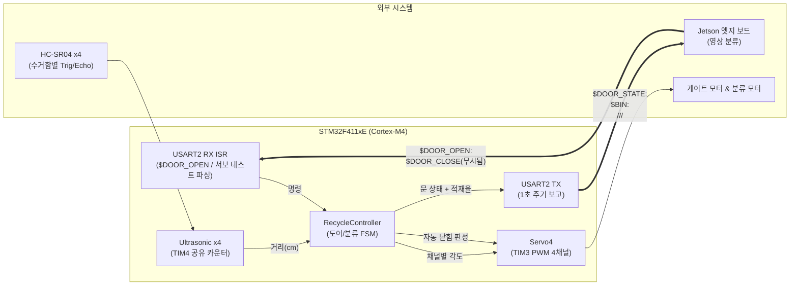

# Smart Recycling MCU Firmware

[](https://www.st.com/en/microcontrollers-microprocessors/stm32f411.html)
[]()
[]()
[-lightgrey)]()
[]()

> **STM32F411 기반 스마트 재활용 키오스크 액추에이터 제어 펌웨어**  
> Jetson(영상 분류 보드)이 판별한 재활용품 종류를 UART로 수신하여 게이트/분류 서보를 구동하고, 초음파 센서로 4개 수거함의 적재율을 실시간 측정해 다시 UART로 보고하는 베어메탈 펌웨어입니다.

---

## 📌 목차 (Table of Contents)

1. [프로젝트 개요](#-프로젝트-개요)
2. [시스템 아키텍처 및 데이터 흐름](#-시스템-아키텍처-및-데이터-흐름)
3. [핵심 엔지니어링 특징 및 안전 설계](#-핵심-엔지니어링-특징-및-안전-설계)
4. [하드웨어 및 개발 환경 사양](#-하드웨어-및-개발-환경-사양)
5. [디렉토리 구조](#-디렉토리-구조)
6. [통신 프로토콜 규격](#-통신-프로토콜-규격)
7. [빌드 및 플래시 가이드](#-빌드-및-플래시-가이드)
8. [설정 가이드 (Configuration)](#️-설정-가이드-configuration)
9. [트러블슈팅 (FAQ)](#-트러블슈팅-faq)

---

## 💡 프로젝트 개요

본 프로젝트는 스마트 분리수거 키오스크의 액추에이터 제어 담당 MCU 펌웨어입니다.
Jetson 엣지 보드가 카메라 영상으로 판별한 재활용품 종류(PET, CAN, PAPER, VINYL)를 UART ASCII 프로토콜로 수신하여 분류 서보와 게이트 서보를 순차 구동하며, 4채널 초음파 센서로 각 수거함의 적재율을 주기적으로 측정해 Jetson에 보고합니다. 문 개폐는 3중 안전장치(최소 개방 시간, 비움 디바운스, 최대 개방 타임아웃)를 통해 보드 자체적으로 판단합니다.

### 주요 기능

- **UART ASCII 프로토콜 기반 Jetson 연동**: `$DOOR_OPEN:<ITEM>` 명령 수신 시 분류 서보 위치 후 게이트 오픈, 사람용 서보 테스트 명령 병행 지원
- **4채널 PWM 서보 제어**: TIM3 기반 20ms 주기 PWM으로 게이트 1채널 + 분류 모터 2채널(LEFT/RIGHT 2비트 조합으로 4방향 표현) 구동, 각도/속도 램프 지원
- **4채널 초음파 적재율 측정**: TIM4 공유 카운터 기반 순차 측정으로 4개 수거함의 거리를 cm 단위로 산출 후 캘리브레이션된 기준값으로 적재율(%) 환산
- **3중 안전장치 자동 도어 닫힘**: 최소 개방 시간, 비움 디바운스, 최대 개방 타임아웃을 통해 오작동 및 방치를 원천 방지
- **인터럽트 기반 논블로킹 UART 수신**: USART2 RX 인터럽트로 명령을 즉시 파싱하여 메인 루프(super loop) 지연 최소화

---

## 🏗 시스템 아키텍처 및 데이터 흐름

MCU 펌웨어는 UART 명령 처리, 서보 상태 갱신, 초음파 측정, 주기 보고가 단일 super loop 안에서 논블로킹으로 상호 간섭 없이 동작하도록 설계되었습니다.



---

## ⚡ 핵심 엔지니어링 특징 및 안전 설계

### 1. 인터럽트 기반 UART 명령 파싱 ([isr.c](isr.c), [uart.c](uart.c))

- **USART2 RX 인터럽트**: `$`로 시작하는 라인은 Jetson 프로토콜(`$DOOR_OPEN`, `$DOOR_CLOSE`)로, 그 외는 사람이 입력하는 서보 테스트 명령(`<servo> <angle> [speed]`)으로 분기 파싱
- **미등록 인터럽트 안전장치**: 예기치 않은 인터럽트 발생 시 시스템 크래시 대신 안전한 기본 핸들러로 처리

### 2. 4채널 PWM 서보 제어 및 램프 ([servo4.c](servo4.c), [timer.c](timer.c))

- **TIM3 기반 20ms/50Hz PWM**: 0.5~2.5ms 펄스 폭으로 표준 서보 각도(0~180°) 제어
- **분류 방향 2비트 인코딩**: CH1(LEFT/RIGHT), CH2(LEFT/RIGHT) 조합으로 PET/CAN/PAPER/VINYL 4방향을 2채널만으로 표현하여 하드웨어 자원 절약
- **속도 기반 각도 램프**: `speed(deg/s)` 파라미터로 급격한 서보 이동에 따른 기계적 충격과 전류 스파이크 방지

### 3. 4채널 순차 초음파 거리 측정 ([ultrasonic.c](ultrasonic.c))

- **TIM4 공유 1us 카운터**: 4개 센서(HC-SR04류)가 GPIOC Trig/Echo 핀과 단일 타이머를 공유하며 순차적으로 측정해 자원 사용 최소화
- **왕복 시간 기반 거리 환산**: `거리(cm) = pulse_us / 58` (음속 340m/s 기준), 무응답(10ms 초과) 또는 사거리 초과(30ms 초과, 약 5m) 시 `-1.0f`로 안전 반환
- **캘리브레이션 기반 적재율(%) 산출**: `BIN_EMPTY_CM(30) ~ BIN_FULL_CM(5)` 구간을 0~100%로 clamp 변환

### 4. 3중 안전장치 자동 도어 닫힘 FSM ([recycle.c](recycle.c))

| 조건            | 값      | 목적                                                    |
| :-------------- | :------ | :------------------------------------------------------ |
| 최소 개방 시간  | 2000ms  | 열자마자 "비었음"으로 오판해 바로 닫히는 것 방지         |
| 비움 디바운스   | 1200ms  | 거리 ≥ 25cm(비어 보임) 상태가 지속돼야 실제로 닫음 (노이즈 필터) |
| 최대 개방 시간  | 10000ms | 방치 시 무한정 열려있지 않도록 하는 failsafe             |

- 문이 열려 있는 동안 150ms 주기로 해당 수거함 거리를 체크하여 위 3개 조건을 판정
- `$DOOR_CLOSE` 명령은 의도적으로 무시되며, 닫힘은 항상 보드가 자체 판단 (오프라인 안전 우선 설계)

### 5. newlib 재타겟 및 시스템 초기화 ([syscalls.c](syscalls.c), [clock.c](clock.c))

- **printf 디버그 출력**: `syscalls.c`에서 newlib 시스템 콜을 UART로 재타겟하여 `printf` 기반 디버깅 지원
- **부팅 시퀀스**: FPU 활성화 → PLL 클럭 설정 → UART2 초기화 → SysTick(1ms)/PWM 타이머 초기화 → 초음파 GPIO/TIM4 초기화 → 서보 중앙값 정렬 → UART RX 인터럽트 활성화 순으로 안전하게 초기화

---

## 💻 하드웨어 및 개발 환경 사양

| 구분           | 사양 및 환경                                                              |
| :------------- | :------------------------------------------------------------------------ |
| **MCU**        | STM32F411xE (Cortex-M4, Hardware FPU)                                     |
| **통신**       | USART2 (PA2/PA3, 115200bps, 8N1) — Jetson/터미널 실통신 채널, USART1은 예비/디버깅용 |
| **서보**       | 4채널 PWM (TIM3, 20ms/50Hz 주기, 0.5~2.5ms 펄스)                          |
| **초음파 센서**| 4채널 (HC-SR04류), GPIOC Trig/Echo, TIM4(1us 카운터) 공유 순차 측정        |
| **플래시**     | ST-Link (SWD), 시작 주소 `0x08000000`                                     |
| **툴체인**     | ARM GNU 툴체인 (`arm-none-eabi-gcc`)                                      |

### 서보 채널 배정

| 채널 | 역할                                              |
| :--- | :------------------------------------------------ |
| CH0  | 게이트(문) 개폐                                    |
| CH1, CH2 | 분류 모터 — LEFT/RIGHT 조합(2비트)으로 PET/CAN/PAPER/VINYL 4방향 표현 |
| CH3  | 미사용                                              |

### 초음파 채널 → 수거함

| 채널 | 수거함 |
| :--- | :----- |
| CH0  | PAPER  |
| CH1  | CAN    |
| CH2  | PET    |
| CH3  | VINYL  |

---

## 📁 디렉토리 구조

```plaintext
mcu_firmware/
├── main.c                    # 메인 루프(super loop) — UART 명령 처리, 서보 업데이트, 자동 닫힘 체크, 주기 보고
├── isr.c                     # 인터럽트 핸들러 (SysTick, USART2 RX, 미등록 인터럽트 안전장치)
├── uart.c                    # USART1/2 초기화 및 송수신
├── ultrasonic.c               # 초음파 센서 4채널 거리 측정
├── servo4.c                  # 서보 4채널 각도/속도 제어 (PWM 펄스 변환 + 램프)
├── timer.c                   # SysTick(1ms 틱), TIM3 PWM 초기화
├── recycle.c                 # 게이트/분류 서보를 묶은 도어 제어 상태머신, 자동 닫힘 로직
├── clock.c                   # 시스템 클럭(PLL) 설정
├── system_stm32f4xx.c        # 시스템 클럭(PLL) 설정
├── syscalls.c                # newlib 재타겟 (printf 등을 UART로 연결)
├── device_driver.h            # 공통 include, 레지스터 조작 매크로
├── macro.h                    # 레지스터 조작 매크로
├── option.h                   # 보드 설정값
├── rom_0x08000000.lds         # 링커 스크립트 (플래시 시작주소 0x08000000)
├── Makefile                   # 빌드/플래시 스크립트 (TOOL_DIR 경로 지정)
└── README.md                  # 본 문서
```

---

## 📡 통신 프로토콜 규격

### Jetson $\leftrightarrow$ MCU UART ASCII 프로토콜

- **보드레이트**: 115200 bps, 8N1, 개행문자 `\n` (LF)

**입력 (MCU가 받는 명령)**

| 명령                     | 형식                                      | 설명                                             |
| :----------------------- | :---------------------------------------- | :------------------------------------------------ |
| 서보 테스트 (사람용)     | `<servo 1~3> <angle 0~180> [speed deg/s]` | 예: `1 90`, `1 90 30`. speed 생략 시 즉시 이동    |
| 도어 오픈 (Jetson용)     | `$DOOR_OPEN:<PET\|CAN\|PAPER\|VINYL>`     | 분류 서보 위치 후 300ms 뒤 게이트 오픈            |
| 도어 클로즈 (Jetson용)   | `$DOOR_CLOSE`                              | 무시됨 — 닫힘은 항상 보드가 자동 판단             |

**출력 (MCU가 보내는 상태)**

| 메시지   | 형식                                          | 전송 시점                     |
| :------- | :-------------------------------------------- | :----------------------------- |
| 문 상태  | `$DOOR_STATE:OPEN` / `$DOOR_STATE:CLOSED`     | 상태 변화 시 + 1초 주기        |
| 적재율   | `$BIN:<paper>/<can>/<pet>/<vinyl>` (0~100)    | 1초 주기                       |

---

## 🚀 빌드 및 플래시 가이드

### 1. ARM GNU 툴체인 경로 설정

`Makefile`의 `TOOL_DIR` 변수에 `arm-none-eabi-gcc`가 설치된 경로를 지정합니다.

```makefile
TOOL_DIR = /path/to/gcc-arm-none-eabi/bin
```

### 2. 빌드

```bash
make        # rom_0x08000000.bin / .elf 생성
```

### 3. 빌드 산출물 정리

```bash
make clean  # 빌드 산출물 삭제
```

### 4. ST-Link(SWD)로 플래시

```bash
make run    # ST-Link(SWD)로 보드에 플래시 후 리셋
```

---

## ⚙️ 설정 가이드 (Configuration)

주요 안전/캘리브레이션 파라미터는 [`option.h`](option.h) 및 [`recycle.c`](recycle.c)에서 관리됩니다.

```c
// 초음파 적재율 캘리브레이션 기준값
#define BIN_EMPTY_CM   30   // 빈 통일 때 거리 (cm)
#define BIN_FULL_CM    5    // 꽉 찬 통일 때 거리 (cm)

// 도어 자동 닫힘 3중 안전장치 (ms)
#define DOOR_MIN_OPEN_MS      2000   // 최소 개방 시간
#define DOOR_EMPTY_DEBOUNCE_MS 1200  // 비움 디바운스
#define DOOR_MAX_OPEN_MS      10000  // 최대 개방 타임아웃

// UART 통신 설정
#define UART_BAUDRATE  115200
#define UART_PORT      USART2   // PA2/PA3
```

---

## 🔧 트러블슈팅 (FAQ)

### Q1. `$DOOR_OPEN` 명령을 보냈는데 게이트가 열리지 않습니다.

- 원인: UART 배선(PA2/PA3) 미접속이거나 보드레이트 불일치(115200bps가 아님).
- 해결: 오실로스코프나 로직 애널라이저로 TX/RX 라인을 확인하고, Jetson과 MCU 양쪽의 보드레이트 설정이 115200bps로 일치하는지 점검합니다.

### Q2. 초음파 센서 값이 항상 `-1.0f`로만 나옵니다.

- 원인: Echo 핀 배선 불량이거나 센서 전원(5V) 미공급, 혹은 사거리(약 5m) 초과 대상까지 측정 시도.
- 해결: `ls`(하드웨어 배선) 재확인 후 센서를 30cm 이내 물체에 근접시켜 응답 여부를 테스트합니다.

### Q3. 서보가 목표 각도에 도달하기 전에 다음 명령이 무시됩니다.

- 원인: `speed(deg/s)` 파라미터로 램프 진행 중일 때 `Servo4_Update`가 아직 이전 이동을 완료하지 않은 상태.
- 해결: 이전 이동이 끝날 때까지 대기하거나, 즉시 이동이 필요하면 `speed`를 생략하여 즉시 이동 모드로 명령합니다.

### Q4. `make run` 실행 시 ST-Link를 찾지 못합니다.

- 원인: ST-Link 드라이버 미설치이거나 USB 연결 불량, 혹은 다른 프로세스(디버거 등)가 SWD 인터페이스를 점유 중.
- 해결: `st-info --probe` 등으로 ST-Link 인식 여부를 확인하고, 점유 중인 디버깅 세션(IDE 등)을 종료한 후 재시도합니다.

### Q5. Jetson이 연결되지 않아도 서보 테스트가 가능한가요?

- 예. USART2로 사람이 직접 `<servo> <angle> [speed]` 형식의 명령을 터미널에서 전송하면 Jetson 프로토콜과 무관하게 서보를 개별 테스트할 수 있습니다.