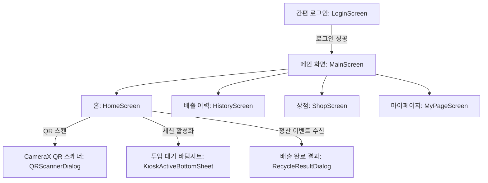
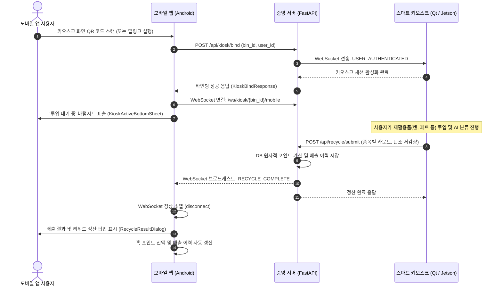

# 📱 스마트 분리배출 엣지 AI - 모바일 애플리케이션 (Android)

> **스마트 리사이클링 키오스크(Qt) & 엣지 AI(Jetson)와 실시간 연동되는 친환경 리워드 모바일 앱**  
> Jetpack Compose, Kotlin Coroutines/Flow, Hilt, CameraX, WebSocket 기술을 기반으로 구축된 차세대 에코 라이프스타일 애플리케이션입니다.

---

## 📌 목차 (Table of Contents)
1. [프로젝트 소개](#1-프로젝트-소개)
2. [시스템 및 개발 환경 요구사항 (Requirements)](#2-시스템-및-개발-환경-요구사항-requirements)
3. [기술 스택 (Tech Stack)](#3-기술-스택-tech-stack)
4. [화면 구성 및 핵심 기능 (Screen & Features)](#4-화면-구성-및-핵심-기능-screen--features)
5. [에코 게이미피케이션 & 보상 산출 규격 (Eco Gamification)](#5-에코-게이미피케이션--보상-산출-규격-eco-gamification)
6. [프로젝트 디렉토리 구조](#6-프로젝트-디렉토리-구조)
7. [API 및 실시간 웹소켓 명세](#7-api-및-실시간-웹소켓-명세)
8. [빌드 및 테스트 가이드 (Getting Started & Test)](#8-빌드-및-테스트-가이드-getting-started--test)
9. [시스템 아키텍처 및 통신 플로우 (System Architecture)](#9-시스템-아키텍처-및-통신-플로우-system-architecture)

---

<a id="1-프로젝트-소개"></a>
## 1. 프로젝트 소개

**스마트 분리배출 모바일 앱**은 AI 비전 기반 스마트 키오스크와 실시간으로 상호작용하여 시민들의 자발적이고 올바른 재활용 분리배출을 유도하고 보상하는 안드로이드 애플리케이션입니다.

- **원터치 QR 연동**: 키오스크 화면에 표시된 QR 코드를 카메라로 스캔하거나 딥링크를 수신하여 대기 없이 즉시 기기와 1:1 세션을 바인딩합니다.
- **실시간 정산 피드백**: 키오스크에서 투입 완료 시 WebSocket 푸시 이벤트(`RECYCLE_COMPLETE`)를 수신하여 4대 배출 품목(종이, 캔, 페트, 비닐)별 수량, 적립 포인트, 탄소 저감량($\text{g } \text{CO}_2$)을 팝업으로 즉시 안내합니다.
- **에코 게이미피케이션**: 배출 활동에 따른 에코 등급(새싹 🌱, 어린 나무 🌿, 울창한 숲 🌳) 및 소나무 식수 환산 지표를 제공합니다.
- **포인트 리워드 샵**: 적립된 에코 포인트를 활용하여 기프티콘, 종량제 봉투, 환경 단체 기부 상품으로 교환할 수 있습니다.

---

<a id="2-시스템-및-개발-환경-요구사항-requirements"></a>
## 2. 시스템 및 개발 환경 요구사항 (Requirements)

별도의 파이썬 환경(`requirements.txt`)이 필요하지 않으며, Gradle 버전 카탈로그(`libs.versions.toml`) 기반 안드로이드 표준 빌드 환경을 사용합니다.

| 구분 | 요구 스펙 및 버전 | 비고 |
| :--- | :--- | :--- |
| **Android Studio** | Android Studio Ladybug (2024.2.1) 이상 권장 | Kotlin Compose 통합 플러그인 지원 |
| **JDK (Java)** | **Java 17** 이상 (권장: Android Studio 내장 JBR 17 또는 21) | `JAVA_HOME` 환경변수 설정 필수 |
| **Min SDK** | **API 26 (Android 8.0 Oreo)** | 95% 이상의 실사용 안드로이드 디바이스 커버 |
| **Target SDK / Compile SDK** | **API 37** | 최신 안드로이드 플랫폼 API 및 Edge-to-Edge 지원 |
| **Gradle** | **Gradle 9.7.1** (Gradle Wrapper 포함) | `gradlew` 자동 다운로드 및 캐싱 지원 |
| **Android Gradle Plugin (AGP)** | **9.4.0** | 최신 빌드 캐시 및 컴파일 최적화 |
| **Kotlin** | **2.4.10** | Jetpack Compose 통합 컴파일러 사용 |
| **KSP** | **2.3.11** | Hilt 및 Moshi 컴파일 타임 코드 생성기 |

---

<a id="3-기술-스택-tech-stack"></a>
## 3. 기술 스택 (Tech Stack)

### UI & Presentation
- **Jetpack Compose (BOM 2026.08.00)**: 100% 선언형 UI, Material 3 Design System 적용
- **Compose Lifecycle & Navigation**: `collectAsStateWithLifecycle` 기반 백그라운드 절전 처리
- **Design Tokens**: `ForestEmerald`, `SkyBlue`, `AmberAccent` 기반 친환경 테마 및 다크 모드 완벽 대응

### Architecture & Optimization
- **Clean Architecture + MVVM + MVI 단방향 데이터 흐름 (UDF)**
- **UI State Immutability**: UI State 및 Domain Entity에 `@Immutable` 적용으로 불필요한 리컴포지션 방지
- **Method Reference Optimization**: 인라인 람다 재생성을 억제하고 안정된 함수 참조(Method Reference) 유지

### Dependency Injection & Async
- **Dagger Hilt (2.60.1)**: KSP 기반 컴파일 타임 의존성 주입 (Network, Repository, Storage 모듈)
- **Kotlin Coroutines & Flow**: `StateFlow`, `SharedFlow`를 활용한 반응형 비동기 스트림 파이프라인

### Network & Data Storage
- **Retrofit (3.0.0)** & **OkHttp (5.5.0)**: REST API 통신 및 HTTP 로깅 인터셉터
- **OkHttp WebSocket**: 키오스크-모바일 실시간 1:1 세션 이벤트 양방향 리스너
- **Moshi (1.15.2)**: KSP CodeGen 기반 엄격한 Null-Safety DTO 직렬화/역직렬화
- **Jetpack DataStore (Preferences 1.2.1)**: 유저 세션 및 잔여 포인트 로컬 영속화

### Hardware & Vision Integration
- **CameraX (1.6.2)**: `PreviewView`, `ImageAnalysis` 기반 저지연 카메라 하드웨어 제어 및 자원 확실한 회수
- **Google ML Kit Barcode Scanning (17.3.0)**: 초당 30프레임 무지연 고속 QR 코드 디코딩

---

<a id="4-화면-구성-및-핵심-기능-screen--features"></a>
## 4. 화면 구성 및 핵심 기능 (Screen & Features)

앱은 **단일 액티비티(Single Activity, `MainActivity`)** 기반으로 동작하며, 로그인 상태에 따라 로그인 화면과 4대 하단 네비게이션 탭으로 분기됩니다.



### 1. 화면별 상세 기능 명세
| 화면 (Screen) | Composable | 주요 기능 및 특징 |
| :--- | :--- | :--- |
| **로그인 (Login)** | `LoginScreen` | • 휴대폰 번호 10~11자리 숫자 자동 필터링 및 유효성 검사<br>• 비밀번호 없는 간편 시작 (신규 회원은 DB에 자동 등록)<br>• DataStore 기반 세션 자동 유지 및 자동 로그인 |
| **홈 (Home)** | `HomeScreen` | • 유저 인사말 및 휴대폰 번호 마스킹 표출 (`PhoneUtils`)<br>• 실시간 보유 포인트 잔액 카드 및 당겨서 새로고침 (`PullToRefreshBox`)<br>• **투입구 열기 버튼**: CameraX 기반 초고속 QR 스캐너 호출<br>• **키오스크 활성 세션 바텀시트 (`KioskActiveBottomSheet`)**: 연결 중 펄스 애니메이션 표출<br>• **배출 결과 정산 다이얼로그 (`RecycleResultDialog`)**: 4대 품목별 수량, 탄소 저감량, 포인트 획득량 안내 |
| **배출 이력 (History)** | `HistoryScreen` | • 누적 총 배출 횟수 및 총 탄소 저감량($\text{g } \text{CO}_2$) 요약 카드<br>• 최신순 분리배출 내역 카드 목록 (`LazyColumn`, 고유 Key 바인딩)<br>• 배출 기록 0건일 때의 친환경 Empty State 렌더링 |
| **포인트 상점 (Shop)** | `ShopScreen` | • 4대 카테고리 필터링 칩 (`전체`, `기프티콘`, `종량제 봉투`, `환경 기부`)<br>• 실시간 포인트 잔액 대비 구매 가능 여부 판정 (포인트 부족 시 반투명 처리 및 비활성화)<br>• 서버 원자적 포인트 차감 연동 (`POST /api/users/deduct`)<br>• 교환 완료 즉시 오프라인 사용 가능한 고유 쿠폰 바코드 번호 발급 시뮬레이션 |
| **마이페이지 (MyPage)** | `MyPageScreen` | • 사용자 프로필 및 누적 친환경 등급 배지 표출<br>• 소나무 식수 환산 지표 표출<br>• 4대 품목별(종이, 캔, 페트, 비닐) 올바른 분리배출 팁 안내<br>• 세션 정리 및 안전 로그아웃 다이얼로그 |

---

<a id="5-에코-게이미피케이션--보상-산출-규격-eco-gamification"></a>
## 5. 에코 게이미피케이션 & 보상 산출 규격 (Eco Gamification)

모바일 앱과 엣지 키오스크는 통일된 친환경 지표 공식을 공유합니다.

### 1. 3단계 에코 등급제 (`EcoLevel`)
누적 배출 횟수를 기준으로 사용자의 환경 기여도 등급이 실시간으로 승급됩니다.
- 🌱 **새싹 (SPROUT)**: 1 ~ 5회 배출 ("지구를 위한 위대한 첫걸음!")
- 🌿 **어린 나무 (YOUNG_TREE)**: 6 ~ 15회 배출 ("꾸준한 배출로 싱그러운 나뭇잎이 피어나요!")
- 🌳 **울창한 숲 (LUSH_FOREST)**: 16회 이상 배출 ("지구를 구하는 에코 히어로! 푸른 숲을 이루었어요!")

### 2. 탄소 저감량 및 소나무 식수 환산 공식
- **소나무 1그루 연간 흡수량**: $6,600\text{g } \text{CO}_2$ ($6.6\text{kg}$)
- **소나무 식수 효과 계산식**:
  $$\text{식수 효과 (그루)} = \frac{\text{총 누적 탄소 저감량 (g)}}{6,600\text{ g}}$$
- **품목별 단위 탄소 저감량 및 리워드 포인트**:
  - **종이 (Paper)**: $8.5\text{g } \text{CO}_2$ 저감 ($+30\text{P}$)
  - **캔 (Can)**: $25.0\text{g } \text{CO}_2$ 저감 ($+50\text{P}$)
  - **페트 (PET)**: $15.2\text{g } \text{CO}_2$ 저감 ($+50\text{P}$)
  - **비닐 (Vinyl)**: $5.0\text{g } \text{CO}_2$ 저감 ($+10\text{P}$)

---

<a id="6-프로젝트-디렉토리-구조"></a>
## 6. 프로젝트 디렉토리 구조

```
mobile_app/
├── app/
│   ├── src/
│   │   ├── main/
│   │   │   ├── AndroidManifest.xml           # 권한, 액티비티 및 커스텀 딥링크 필터 정의
│   │   │   ├── java/com/hocheol/smartrecyclingedgeai/
│   │   │   │   ├── SmartRecyclingApplication.kt  # Hilt AndroidApp 엔트리포인트
│   │   │   │   ├── MainActivity.kt               # Single Activity, 딥링크 수신 및 화면 라우팅
│   │   │   │   ├── data/
│   │   │   │   │   ├── datasource/FakeShopDataSource.kt   # Mock 상점 상품 목록
│   │   │   │   │   ├── local/SessionManager.kt            # DataStore 세션/포인트 영속화
│   │   │   │   │   ├── model/                             # Moshi DTO
│   │   │   │   │   │   ├── request/                       # KioskBind, Login, PointDeduct Request
│   │   │   │   │   │   └── response/                      # Bind, Deduct, Event, Log, User Response
│   │   │   │   │   ├── remote/                            # Retrofit API & WebSocketManager
│   │   │   │   │   └── repository/                        # AuthRepository, KioskRepository
│   │   │   │   ├── di/                                    # Hilt 모듈 (Network, Repository, Storage)
│   │   │   │   ├── domain/model/                          # 도메인 모델 (User, Log, Result, Shop, Eco)
│   │   │   │   ├── presentation/                          # UI 계층
│   │   │   │   │   ├── common/UiEvent.kt                  # 공통 UI 이벤트 (Snackbar 등)
│   │   │   │   │   ├── history/                           # 배출 이력 Screen, ViewModel, State
│   │   │   │   │   ├── home/                              # 메인 홈, QRScanner, BottomSheet, Dialog
│   │   │   │   │   ├── login/                             # 로그인 Screen, ViewModel, State
│   │   │   │   │   ├── main/MainScreen.kt                 # 하단 4개 탭 BottomNavigation 관리
│   │   │   │   │   ├── mypage/                            # 마이페이지 Screen, ViewModel, State
│   │   │   │   │   └── shop/                              # 상점 Screen, ViewModel, State
│   │   │   │   ├── ui/theme/                              # Color, Theme, Type 디자인 시스템 토큰
│   │   │   │   └── utils/                                 # Constants, PhoneUtils
│   │   │   └── res/                                       # strings, colors, dimens, drawables
│   │   └── test/ / androidTest/
│   └── build.gradle.kts                          # 모듈 빌드 스크립트 (KSP, Hilt, Compose)
├── gradle/
│   ├── libs.versions.toml                        # 버전 카탈로그
│   └── wrapper/gradle-wrapper.properties
├── build.gradle.kts                              # 루트 빌드 스크립트
└── settings.gradle.kts                           # 프로젝트 설정
```

---

<a id="7-api-및-실시간-웹소켓-명세"></a>
## 7. API 및 실시간 웹소켓 명세

모바일 앱은 중앙 FastAPI 서버(`http://{SERVER_IP}:8000/`)와 통신합니다.

### 1. REST API 엔드포인트
| 메소드 | 엔드포인트 | 요청 Body | 응답 DTO | 설명 |
| :--- | :--- | :--- | :--- | :--- |
| `POST` | `/api/auth/login` | `LoginRequest(phone, name?)` | `UserResponse` | 휴대폰 번호 간편 로그인 및 신규 회원 자동 등록 |
| `GET` | `/api/users/{user_id}` | - | `UserResponse` | 사용자 프로필 및 최신 보유 포인트 조회 |
| `POST` | `/api/kiosk/bind` | `KioskBindRequest(bin_id, user_id)` | `KioskBindResponse` | 모바일 앱과 키오스크 세션 바인딩 요청 |
| `GET` | `/api/users/{user_id}/logs` | - | `RecycleLogListResponse` | 사용자별 분리배출 정산 내역 목록 최신순 조회 |
| `POST` | `/api/users/deduct` | `PointDeductRequest(user_id, amount, description)` | `PointDeductResponse` | 상점 상품 교환 시 원자적 포인트 차감 |

### 2. WebSocket 실시간 정산 이벤트
- **엔드포인트**: `ws://{SERVER_IP}:8000/ws/kiosk/{bin_id}/mobile`
- **수신 이벤트 (`RECYCLE_COMPLETE`) 페이로드 예시**:
```json
{
  "event": "RECYCLE_COMPLETE",
  "user_id": 1,
  "earned_points": 140,
  "total_points": 5140,
  "carbon_saved_g": 48.7,
  "can_count": 1,
  "pet_count": 1,
  "paper_count": 1,
  "vinyl_count": 1
}
```

### 3. 딥링크 스펙
- **URI 스킴**: `smartrecycle://kiosk/auth?bin_id={BIN_ID}`
- 키오스크 화면의 QR 코드 내용 또는 NFC 태그 수신 시 앱이 자동 실행되며 바인딩을 수행합니다.

---

<a id="8-빌드-및-테스트-가이드-getting-started--test"></a>
## 8. 빌드 및 테스트 가이드 (Getting Started & Test)

### 1. 저장소 클론 및 프로젝트 열기
```bash
git clone https://github.com/96hckim/smart-recycling-edge-ai.git
# Android Studio 실행 후 `mobile_app` 디렉토리를 열기
```

### 2. 서버 접속 IP 설정
개발 환경에 맞춰 [Constants.kt](app/src/main/java/com/hocheol/smartrecyclingedgeai/utils/Constants.kt)의 네트워크 주소를 수정합니다.

- **파일 위치**: `app/src/main/java/com/hocheol/smartrecyclingedgeai/utils/Constants.kt`
- **환경별 주소 가이드**:
  | 환경 | `BASE_URL` 설정 예시 | `WS_BASE_URL` 설정 예시 | 비고 |
  | :--- | :--- | :--- | :--- |
  | **안드로이드 에뮬레이터** | `http://10.0.2.2:8000/` | `ws://10.0.2.2:8000/` | 호스트 PC의 로컬 백엔드로 루프백 접속 |
  | **실제 스마트폰 디바이스** | `http://192.168.x.x:8000/` | `ws://192.168.x.x:8000/` | PC와 동일한 Wi-Fi 공유기에 연결 |
  | **공용/원격 개발 서버** | `http://100.72.78.11:8000/` | `ws://100.72.78.11:8000/` | 고정 IP 또는 VPN 네트워크 환경 |

```kotlin
object Constants {
    const val BASE_URL = "http://<YOUR_SERVER_IP>:8000/"
    const val WS_BASE_URL = "ws://<YOUR_SERVER_IP>:8000/"
    // ...
}
```

> [!NOTE]
> `AndroidManifest.xml`에 `android:usesCleartextTraffic="true"`가 이미 구성되어 있어 별도의 네트워크 보안 설정 파일 없이도 로컬 HTTP/WS 통신이 정상 동작합니다.

### 3. Gradle 컴파일 및 디버그 APK 빌드
PowerShell 또는 터미널 환경에서 아래 명령어를 실행합니다. (JDK 17+ 필요)

```powershell
# Windows PowerShell 환경 (Android Studio 내장 JBR 설정 예시)
$env:JAVA_HOME="C:\Program Files\Android\Android Studio\jbr"

# 코틀린 코드 컴파일 검증
.\gradlew.bat compileDebugKotlin

# 디버그 APK 패키징
.\gradlew.bat assembleDebug
```
생성된 APK 위치: `app/build/outputs/apk/debug/app-debug.apk`

### 4. ADB를 이용한 딥링크 단독 테스트
키오스크 하드웨어가 없는 환경에서도 ADB 명령어로 딥링크 바인딩을 즉시 테스트할 수 있습니다.
```bash
adb shell am start -a android.intent.action.VIEW -d "smartrecycle://kiosk/auth?bin_id=1"
```

---

<a id="9-시스템-아키텍처-및-통신-플로우-system-architecture"></a>
## 9. 시스템 아키텍처 및 통신 플로우 (System Architecture)

### 1. 계층형 클린 아키텍처 (Layered Clean Architecture)
관심사 분리(Separation of Concerns) 원칙에 따라 3개 계층으로 엄격하게 격리되어 결합도를 낮추고 테스트 용이성을 극대화했습니다.

```
[Presentation Layer]
  ├── Composable Screens (HomeScreen, HistoryScreen, ShopScreen, MyPageScreen, LoginScreen)
  ├── ViewModels (HomeViewModel, HistoryViewModel, ShopViewModel, MyPageViewModel, LoginViewModel)
  └── UiState & UiEvent (MVI 단방향 데이터 흐름: StateFlow 및 collectAsStateWithLifecycle)
         ▼ (Domain Model 참조)
[Domain Layer]
  └── Immutable Entities (User, RecycleLog, RecycleResult, ShopProduct, EcoGamification)
         ▲ (데이터 변환 및 전달)
[Data Layer]
  ├── Repository (AuthRepository, KioskRepository)
  ├── Remote (AuthApiService, KioskApiService, KioskWebSocketManager)
  ├── Local (DataStore SessionManager)
  └── DTO Models (Moshi KSP 어댑터 기반 Request / Response)
```

### 2. 키오스크-서버-모바일 실시간 통신 시퀀스 (Communication Flow)
사용자가 키오스크 QR 코드를 스캔한 시점부터 최종 정산이 완료될 때까지의 전 과정입니다.



---

## 🛡 코드 품질 및 엔지니어링 안정성 보증
- **Null-Safety 100% 방어**: 백엔드에서 `userId: null`, `totalPoints: null`, `name: null`이 유입되더라도 Moshi가 크래시 없이 디폴트 값으로 안전하게 복구
- **카메라 하드웨어 누수 차단**: `QRScannerDialog` 소멸 시 `ProcessCameraProvider.unbindAll()` 호출로 카메라 자원 즉시 회수
- **WebSocket 라이프사이클 보호**: ViewModel 파괴(`onCleared`) 및 세션 종료 시 소켓 커넥션 누수 차단
- **최신 Compose 표준 준수**: `collectAsStateWithLifecycle` 기반 배터리 절전 처리 및 Method Reference 기반 람다 최적화 완료
